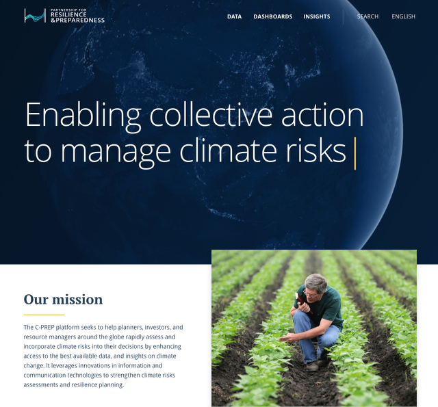

# The Climate Partnership for Resilience and Preparedness



The Climate Partnership for Resilience and Preparedness (C-PREP) is a public-private collaboration whose mission is to help planners, investors, and resource managers around the globe rapidly assess and incorporate climate risks into their decisions by enhancing access to the best available data, and insights on climate change. Climate assessments have traditionally focused on building the case for climate action by publishing static written reports. Users of climate risk data have depended on science ‘translators’ to communicate key messages from assessments and related reports, without having direct access to the underlying data sets.

Today, with growing demand to manage climate risks, assessments need to move beyond making the case for action through words and pictures, to enabling action by guiding users to relevant data and tools. To meet this need, C-PREP will leverage innovations in information and communication technology to enable climate assessment and planning teams to easily develop on-line reports with direct access to useable, continuously updated information, through customizable modern web and mobile apps. It will also provide the building blocks for countries, states, and communities to develop their own climate-risk dashboards: customized online sites containing data, information, tools, and other dynamic resources needed to mainstream climate-risk information into planning and investment decisions.


## Install

Requirements:

* NodeJs 5.2+ [How to install](https://nodejs.org/download/)

To install run this command:

```bash
npm install
```


## Usage

Duplicate `.env.sample`, rename to `.env` and finally set your options in that file.

Run server locally usgin npm:

```bash
npm start
```


## Contributing

1. Fork it!
2. Create your feature branch: `git checkout -b feature/my-new-feature`
3. Commit your changes: `git commit -am 'Add some feature'`
4. Push to the branch: `git push origin feature/my-new-feature`
5. Submit a pull request :D


## LICENSE

[MIT](LICENSE)
